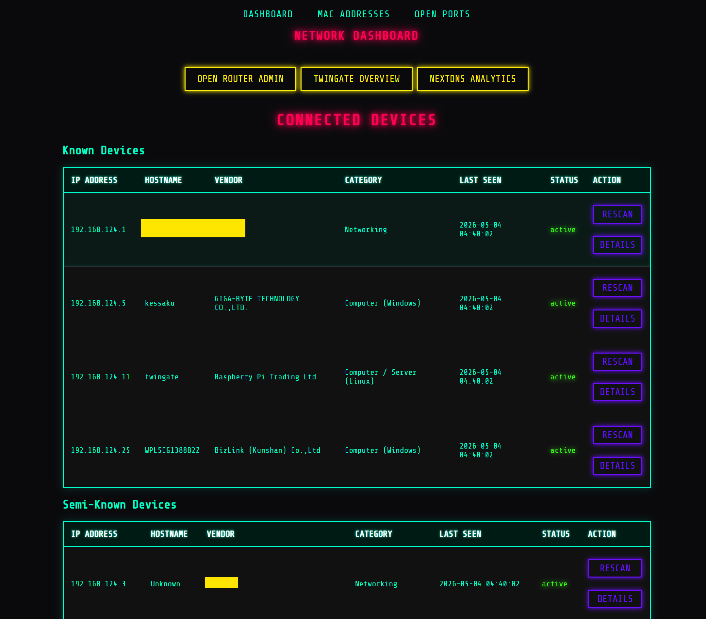

# Network Dashboard




A small web server that allows you to scan and monitor devices on your local network. Built with Python, Flask, and Nmap, featuring a Cyberpunk-inspired UI.

## Getting Started
Install all Dependencies in [dependencies.txt](#dependencies-txt) with
```bash
pip install -r dependencies.txt
```
As well as the following:
1. [Nmap](https://nmap.org/download.html)  

2. [Npcap](https://npcap.com/)  
    *NOTE: If you install Npcap with Nmap, this step is not needed

3. Python virtual environment (recommended):
    *NOTE: I used the name 'net'
```bash
python -m venv venv_name
venv_name\Scripts\activate
pip install -r dependencies.txt
```

### Hidden Files
Network dashboard needs a sqlite3 database to work. I called mine 'network.db' as can be seen at the top of [app.py](#app.py).

You also need to set up an environment file to add any urls you want to use but don't want to be public facing. Do this by add a .env file. This dashboard connects to my Router terminal, Twingate, and NextDNS so my .env file looks like the following:

(Example .env file)
```env
NETWORK_IP_RANGE='192.168.1.0/24'
ROUTER_ADMIN_URL=http://192.168.1.1
TWINGATE_URL=https://XXXXX.twingate.com/networks/overview
NEXTDNS_URL=https://my.nextdns.io/XXXXX/analytics
```
